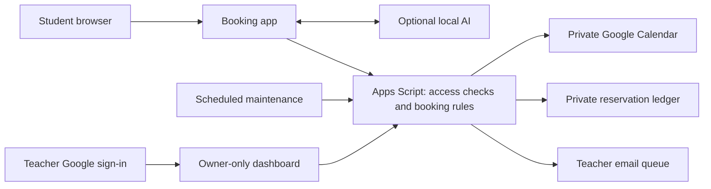

# Meditation Assistant

A small-group scheduling app that replaces weekly scheduling messages with a shared calendar, student booking summaries, and a teacher dashboard. Built with Google Apps Script, Calendar, Sheets, and optional browser-local AI.

## What it does

- Shows one Monday–Sunday week, changing at midnight Monday in Pacific time.
- Supports individual sessions and group capacity, with a four-hour booking cutoff.
- Lets students reserve, cancel, or change sessions after explicit confirmation.
- Prevents duplicate bookings and overselling through server-side checks and a script lock.
- Shows students their own booking summary and gives the teacher an owner-only attendance dashboard.
- Updates attendance in Calendar event descriptions and queues teacher email notices.
- Offers optional on-device conversation using WebLLM and Qwen2.5 0.5B; no cloud AI API key.

## AI and automation

The local model interprets broader requests. Explicit weekday/time booking and change requests also use deterministic matching, because a small local model is not consistently reliable. The interface always asks for confirmation before a change. Calendar rules, capacity enforcement, account checks, and notifications are automation, not AI.

This is a working pilot, not a claim of general conversational intelligence. The original owner reported successful use; device compatibility and broad conversational behavior have not been comprehensively validated. Automated tests use simulated Google services, not the deployed account.



## Run and deploy

Requires Node.js 18+ for building and a Google account for deployment. No npm packages are required for the build or automated tests.

```sh
node build.mjs
node --test test/*.cjs
```

1. Set `OWNER` in `src/Code.gs` to the teacher's Google email. The placeholder is intentionally not a live account. This version uses `America/Los_Angeles`; changing timezone requires reviewing both server and browser configuration.
2. Build, then create a project in Google Apps Script.
3. Paste `dist/MeditationAssistant.gs` into the project's Code.gs. The bundle includes the HTML and shared rules.
4. Use `src/appsscript.json` as the reference manifest and set the project timezone to America/Los_Angeles.
5. Run `setup` from the editor as the owner and authorize the Google permissions. Setup creates a private Calendar, reservation Sheet, 20 student access codes, and a five-minute maintenance trigger. It reuses resources when rerun.
6. Deploy as a web app executing as the owner. Allow Anyone to load the app if appropriate for your audience; student codes still gate booking data. Keep the Calendar and Sheet private.
7. Share one private code per student or family. Never publish the code sheet. Disabling a code in the Access sheet revokes it.
8. Create Calendar sessions as described below. Verify booking, changes, cancellation, owner access, and email delivery in your own deployment before inviting students.
9. Share the web app link through your usual group channel. There is no WhatsApp integration.

The app and maintenance trigger run on Google, so the teacher's laptop need not remain open. AI runs on each student's device while the page is open.

## Calendar setup

Create one non-recurring event per session in the generated Meditation Sessions calendar. Include start/end time, title, optional location, and this description:

```text
Capacity: 4
Booking: open
Notes: Please arrive five minutes early.
```

Use capacity 1 for individual sessions. All-day and recurring events are not offered. Overlapping open sessions are withheld. Do not edit the assistant-managed attendance section.

## Teacher and student views

**Teacher:** sign in with the configured Google owner account, open Teacher dashboard, and refresh it to see session attendance, remaining spaces, participant names, and queued teacher emails. The server checks the active Google user; student codes never authorize this dashboard. If Google does not supply an active owner identity, access is denied.

**Student:** sign in with an assigned private code. My bookings shows reservation status, participants, location, and counts. Confirmation is on-page only: student email, SMS, and WhatsApp notifications are not included.

## Costs and privacy

No paid API, payment method, paid hosting, or automatic billing upgrade is configured. Google quotas still apply; quota exhaustion can delay email or stop requests. Internet/device costs are outside this app. AI downloads may be several hundred MB and require a compatible WebGPU browser. Runtime/model hosts serve downloads; inference stays on the device. Reservation data goes to the owner's Google account.

This public repository contains source and synthetic test fixtures only. It deliberately excludes production access codes, reservation exports, account identifiers, and live deployment links. Treat student codes as passwords. Never commit private spreadsheet data or screenshots containing student details.

## Project layout

| Path | Purpose |
| --- | --- |
| `src/Rules.gs` | Week boundaries, capacity, names, and validation |
| `src/Code.gs` | Google integration, private codes, reservation ledger, dashboard, maintenance |
| `src/Index.html` | Booking UI, summaries, and optional local AI |
| `src/appsscript.json` | Reference permissions and timezone |
| `build.mjs` | Generates a single-file Apps Script bundle and localhost preview |
| `test/` | Scheduling and mocked backend tests using synthetic records |

## Known limitations

- Conversational parsing is intentionally constrained and can fall back to the displayed schedule.
- Google Calendar edits outside the app cannot share the booking lock; reconciliation flags changes for the teacher to address.
- Teacher email is queued and subject to quota; a send-success/write-failure can cause duplicate notices.
- No student email collection, payments, next-week browsing, voice calls, or broadcast messaging.
- This repository is a sanitized showcase snapshot. Pushing a commit does not automatically update the live Google deployment; rebuild and deploy a new version manually.
